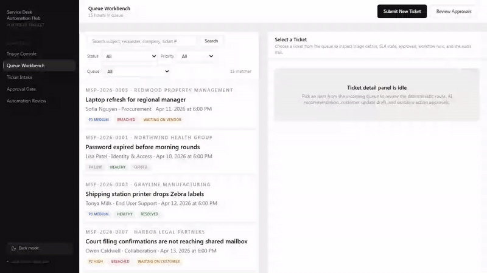
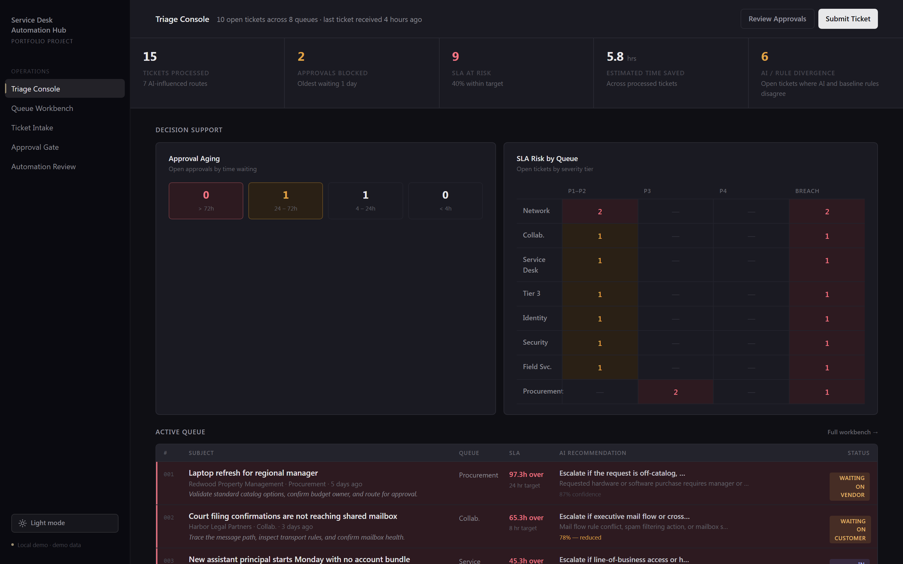
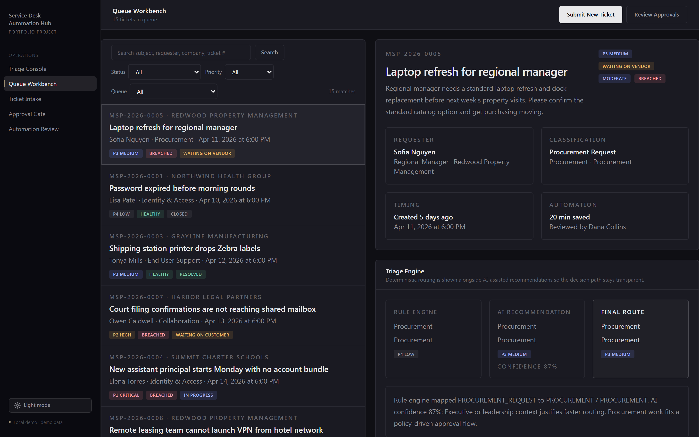
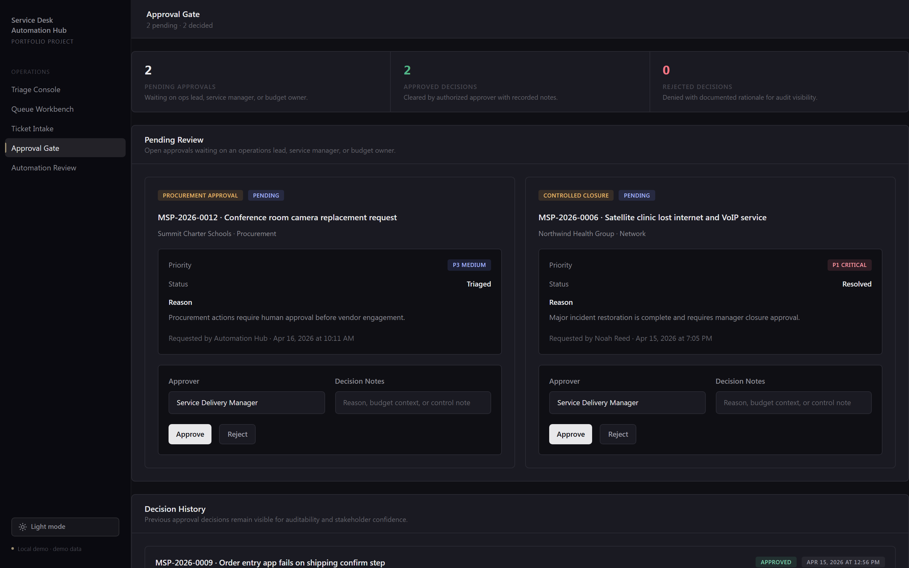
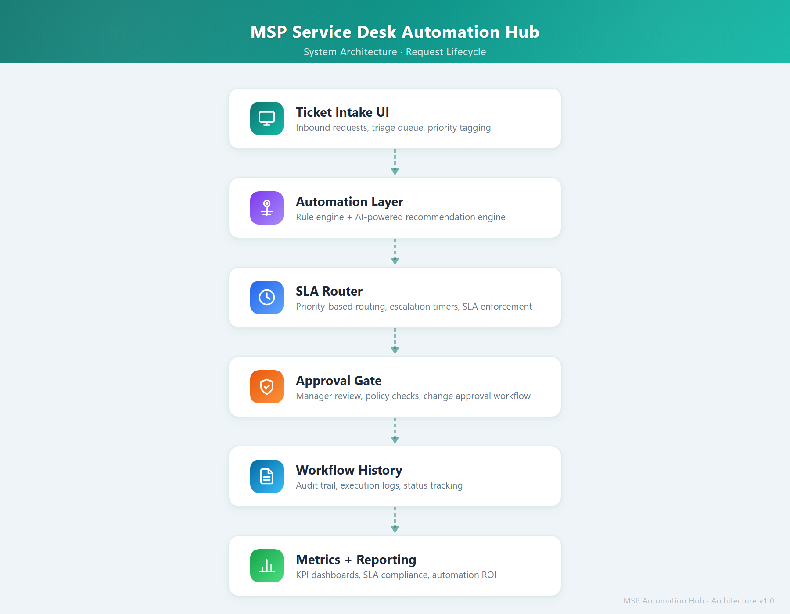

# MSP Service Desk Automation Hub

AI-assisted service desk automation platform demonstrating triage, SLA routing, approval workflows, and operational analytics. Built to show how an MSP can blend deterministic service desk logic with AI-assisted triage, note generation, customer communication, and approval gates while reducing repetitive dispatcher and technician work and keeping sensitive actions human-approved and inspectable.

## Demo



## Screenshots


### Dark mode







## Key Features

- Ticket intake form with live inline validation, character counters, and a submit button that stays disabled until the payload would pass server validation
- Queue workbench with URL-driven text search, status, priority, and queue filters, plus server-side pagination that keeps filter state in the link
- Triage engine that shows rule-based routing and AI-assisted recommendations side by side
- SLA routing based on priority and issue type, with visible response and resolution targets
- AI-assisted technician notes including probable root cause, next step, and escalation guidance
- AI-assisted customer update drafts with a side-by-side reviewer diff that highlights every word the human added or removed before send
- Approval workflow simulation for procurement, tier 3 escalation, and controlled closure
- Workflow history and audit trail for rule-based, AI-assisted, human-approved, and manual actions
- Metrics dashboard with realistic seeded data and reporting
- Automation opportunities page that frames recurring ticket patterns as a strategic automation backlog
- Mock workflow exports that resemble how the same flow could be modeled in n8n
- Light and dark themes with a sidebar toggle, `prefers-color-scheme` fallback, and no flash-of-unstyled-content on first load
- `POST /api/tickets` validates payloads with Zod and returns structured `fieldErrors` on 400

## Architecture



1. A user submits or reviews tickets in the Next.js UI.
2. Server Actions and API routes call the service desk automation layer.
3. The automation layer applies deterministic triage rules, mock AI recommendations, SLA assignment, and approval logic.
4. Prisma persists tickets, workflow runs, approvals, and audit events to SQLite.
5. Dashboard and strategic reporting views aggregate the same operational dataset.

Related docs:

- [Project Overview](docs/project-overview.md)
- [Feature Breakdown](docs/feature-breakdown.md)
- [Workflow Design Notes](docs/workflow-design-notes.md)
- [Business Impact Rationale](docs/business-impact-rationale.md)
- [Demo Walkthrough](docs/demo-walkthrough.md)
- [Future Improvements](docs/future-improvements.md)

## Tech Stack

- Next.js 16 with Server Actions and dynamic routes
- TypeScript
- Tailwind CSS 4 with CSS custom properties driving a light and dark theme toggle
- Prisma ORM against SQLite for tickets, requesters, approvals, workflow runs, and audit events
- Recharts and hand-rolled grid visualisations for KPIs
- Zod v4 for runtime validation at every boundary (server actions, `POST /api/tickets`, intake form, approval and review endpoints)
- A small internal word-level diff utility powering the side-by-side customer-update review — collapses to a clean before/after view when the reviewer rewrites most of the draft
- Playwright for end-to-end flows plus Vitest for unit and integration coverage of the triage engine
- Pluggable AI provider abstraction with a heuristic mock implementation so the demo runs without external credentials

## Demo Walkthrough

1. Start on the dashboard and explain the KPI story: processed volume, AI-influenced routes, approvals, time saved, and SLA compliance.
2. Open the queue workbench and select a ticket that shows both rule-based and AI-assisted routing.
3. Review the ticket detail panel: SLA, internal note, customer update draft, workflow history, and audit trail.
4. Switch to the approvals page and show a pending approval plus a historical decision.
5. Open the automation opportunities page and explain how the same operational data informs future automation investment.
6. Submit a new intake ticket to show the workflow creating a fresh routed record.

See [Demo Walkthrough](docs/demo-walkthrough.md) for a full example workflow lifecycle.

## Local Setup

### Prerequisites

- Node.js 22+
- npm 10+

### Run Locally

```bash
npm install
# PowerShell
Copy-Item .env.example .env

# macOS / Linux
cp .env.example .env

npm run setup
npm run dev
```

Then open `http://localhost:3000`.

### Run Tests

```bash
npm run lint
npm test
```

Unit tests cover the triage engine (priority derivation, sentiment inference, risk calculation, SLA selection, and full automation bundle assembly). Integration tests walk through a complete procurement lifecycle: ticket creation, customer update review, approval decision, and state transition verification with audit trail checks.

### Run Browser E2E Tests

Install the Chromium browser once:

```bash
npx playwright install chromium
```

Then run the browser tests:

```bash
npm run test:e2e
```

The Playwright suite uses an isolated SQLite database, seeds fresh demo data automatically, starts the app on port `3001`, and verifies the core browser flows for ticket intake and approval handling.

## Roadmap

- Add role-based access
- Plug in a real LLM provider
- Support external ticket ingestion via webhook or PSA connector
- Add background jobs and notification channels

See [Future Improvements](docs/future-improvements.md) for current tradeoffs and the full roadmap.

## Repository Structure

```text
src/app                    Next.js routes and API handlers
src/components             Shared UI, charts, and workflow screens
src/lib                    Data layer, actions, automation logic, seed helpers
prisma                     Schema and seed script
docs                       Architecture and portfolio documentation
docs/screenshots           Product screenshots and recapture notes
workflows/exports          Mock workflow definitions
```
