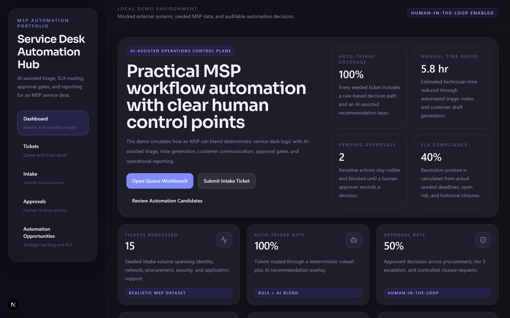
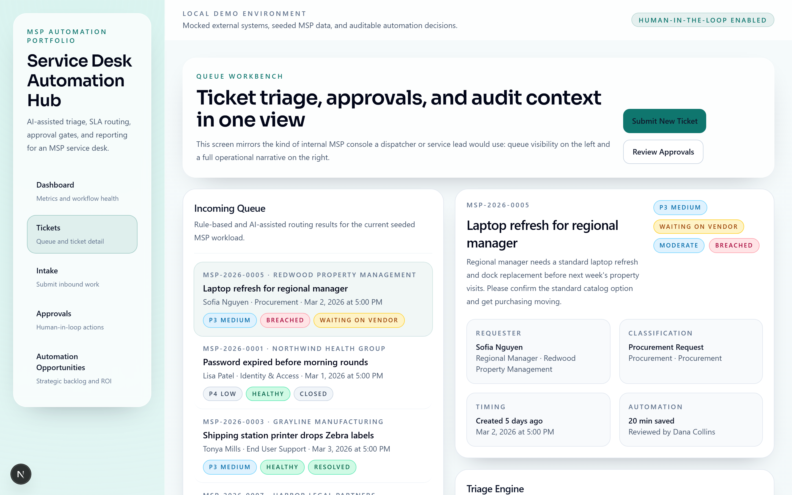
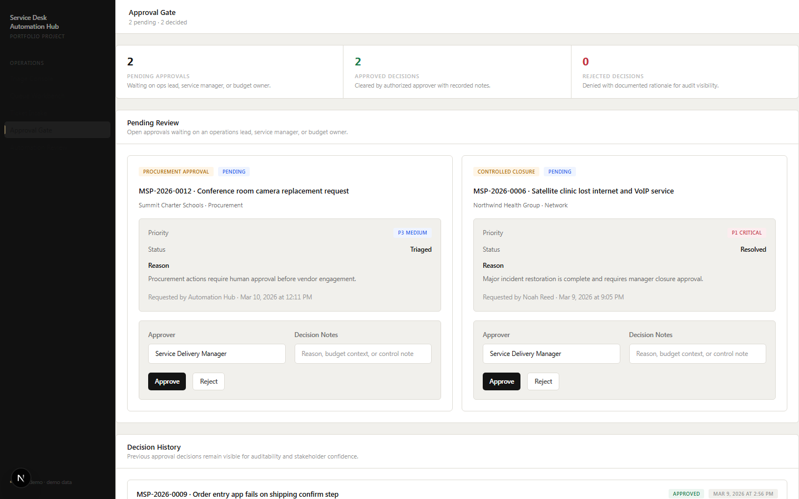
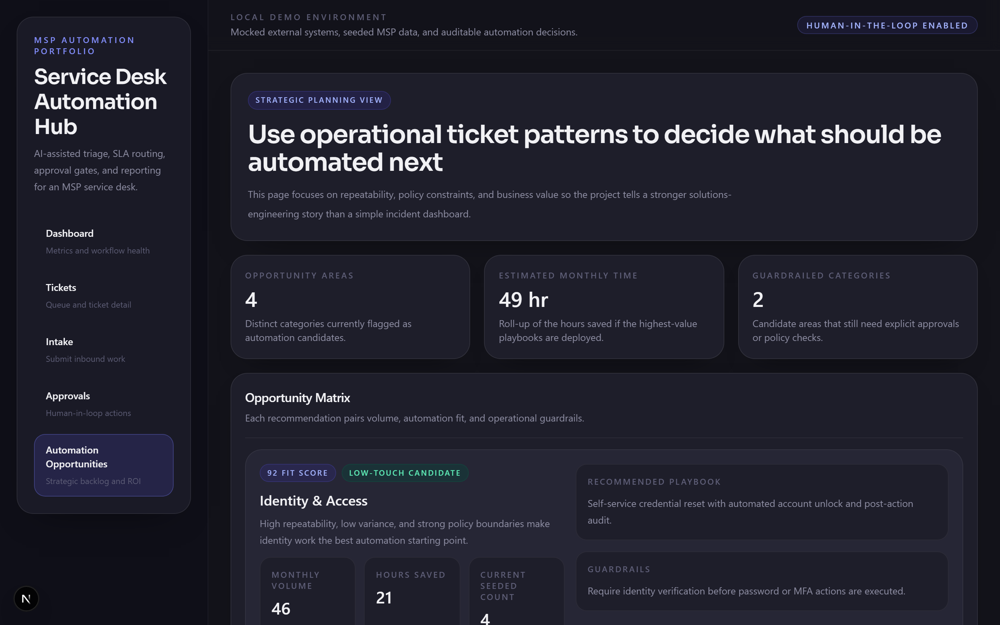

# MSP Service Desk Automation Hub

An internal-tool style demo platform that shows how an MSP can automate service desk operations with AI-assisted workflows, deterministic business logic, approval gates, and operational reporting.

This project is built as a public GitHub portfolio piece for AI Automation Engineer, Automation Engineer, and Solutions Engineer roles. The goal is not to mimic a chatbot. The goal is to demonstrate believable service operations thinking.

Portfolio focus: AI-assisted service desk automation, workflow orchestration, operational guardrails, and measurable business impact inside an MSP environment.

## Why This Project Matters

Most AI portfolio projects stop at a prompt box or a generic agent demo. Service organizations do not run that way.

This repository focuses on where automation is actually valuable inside an MSP:

- standardizing ticket intake
- reducing triage time
- improving routing and SLA consistency
- drafting technician notes and customer updates
- keeping sensitive actions human-approved
- turning ticket data into operational and strategic reporting

It is meant to look like something a hiring manager could imagine inside a real service desk.

## Problem Being Solved

MSP service desks lose time and consistency in the same places over and over:

- incomplete intake data
- inconsistent ticket prioritization
- delayed routing to the right queue
- repetitive note and status update drafting
- weak approval visibility for procurement or escalation actions
- limited insight into which ticket patterns are worth automating next

This project shows a pragmatic answer: combine deterministic workflow rules with AI-assisted drafting and recommendations, while keeping human review where it matters.

## Key Features

- Ticket intake screen with requester, company, issue type, urgency, impact, description, and attachment placeholder fields
- Triage engine that shows rule-based routing and AI-assisted recommendations side by side
- SLA routing based on priority and issue type, with visible response and resolution targets
- AI-generated technician notes including probable root cause, next step, and escalation guidance
- AI-generated customer update drafts with explicit human review before send
- Approval workflow simulation for procurement, tier 3 escalation, and controlled closure
- Workflow history and audit trail for rule-based, AI-assisted, human-approved, and manual actions
- Metrics dashboard with realistic seeded data and reporting
- Automation opportunities page that frames recurring ticket patterns as a strategic automation backlog
- Mock workflow exports that resemble how the same flow could be modeled in n8n

## Architecture Overview

High level flow:

1. A user submits or reviews tickets in the Next.js UI.
2. Server Actions and API routes call the service desk automation layer.
3. The automation layer applies deterministic triage rules, mock AI recommendations, SLA assignment, and approval logic.
4. Prisma persists tickets, workflow runs, approvals, and audit events to SQLite.
5. Dashboard and strategic reporting views aggregate the same operational dataset for demos and screenshots.

Architecture diagram:

- [System Architecture](docs/architecture-diagram.md)

Related docs:

- [Project Overview](docs/project-overview.md)
- [Feature Breakdown](docs/feature-breakdown.md)
- [Workflow Design Notes](docs/workflow-design-notes.md)
- [Business Impact Rationale](docs/business-impact-rationale.md)
- [Future Improvements](docs/future-improvements.md)
- [Resume Bullet Ideas](docs/resume-bullet-ideas.md)

## Tech Stack

- Next.js 16
- TypeScript
- Tailwind CSS 4
- Prisma ORM
- SQLite
- Recharts
- Zod
- Playwright
- Mock AI provider abstraction

## Screenshots

Current product screenshots are included below and can be refreshed locally with the seeded dataset.









Screenshot instructions:

- [Screenshot Capture Notes](docs/screenshots/README.md)

## Local Setup

### Prerequisites

- Node.js 22+
- npm 10+

### Run Locally

```bash
npm install
# PowerShell
Copy-Item .env.example .env

# macOS / Linux
cp .env.example .env

npm run setup
npm run dev
```

Then open `http://localhost:3000`.

### Run Tests

```bash
npm test
```

Unit tests cover the triage engine (priority derivation, sentiment inference, risk calculation, SLA selection, and full automation bundle assembly). Integration tests walk through a complete procurement lifecycle: ticket creation, customer update review, approval decision, and state transition verification with audit trail checks.

### Run Browser E2E Tests

Install the Chromium browser once:

```bash
npx playwright install chromium
```

Then run the browser tests:

```bash
npm run test:e2e
```

The Playwright suite uses an isolated SQLite database, seeds fresh demo data automatically, starts the app on port `3001`, and verifies the core browser flows for ticket intake and approval handling.

## Seeded Demo Data

The repo includes seeded MSP-style tickets across categories such as:

- password reset
- MFA issue
- printer problem
- new user onboarding
- procurement request
- internet outage
- email delivery issue
- VPN access issue
- line-of-business application issue
- security escalation

The seeded dataset also includes:

- approved and pending approvals
- open and closed tickets
- overdue-risk examples
- automation opportunity recommendations

## Demo Walkthrough

Suggested flow for a live walkthrough:

1. Start on the dashboard and explain the KPI story: auto-triage rate, approvals, time saved, SLA compliance.
2. Open the queue workbench and select a ticket that shows both rule-based and AI-assisted routing.
3. Review the ticket detail panel: SLA, internal note, customer update draft, workflow history, and audit trail.
4. Switch to the approvals page and show a pending approval plus a historical decision.
5. Open the automation opportunities page and explain how the same operational data informs future automation investment.
6. Submit a new intake ticket to show the workflow creating a fresh routed record.

## Example Workflow Lifecycle

Example: `LOB application issue affecting shipping`

1. Intake captures company, requester, urgency, impact, and ticket narrative.
2. Rule engine classifies the issue as a business application problem and routes it to tier 3 applications.
3. AI recommendation raises confidence because the description shows a core business workflow impact.
4. SLA profile is assigned based on ticket priority.
5. Internal note and customer update draft are generated automatically.
6. Technician requests a tier 3 escalation approval.
7. Approver records a decision.
8. Workflow run history and audit events preserve the full trail.
9. The ticket contributes to both operational KPIs and strategic automation opportunity reporting.

## Business Value

- Reduces repetitive dispatcher and technician work
- Improves consistency in triage and SLA handling
- Supports safer automation with explicit approval gates
- Makes AI assistance practical and inspectable instead of theatrical
- Creates an automation narrative that connects operations work to measurable business outcomes

## Workflow Artifacts

Sample workflow definitions live in [`workflows/exports`](workflows/exports):

- `ticket-intake-triage-routing.json`
- `approval-gated-escalation.json`
- `customer-update-review-loop.json`
- `daily-ops-reporting-rollup.json`

These are mock exports, but they are structured to communicate how the product logic could be mapped into an automation platform.

## Tradeoffs And Future Roadmap

Current tradeoffs:

- SQLite keeps local setup easy, but Postgres would be the more natural production option
- The AI layer is mocked to keep the repo runnable without external credentials
- Authentication is intentionally omitted so the repo stays easy to demo locally

Future roadmap:

- add role-based access
- plug in a real LLM provider
- support external ticket ingestion via webhook or PSA connector
- add background jobs and notification channels

## Repository Structure

```text
src/app                    Next.js routes and API handlers
src/components             Shared UI, charts, and workflow screens
src/lib                    Data layer, actions, automation logic, seed helpers
prisma                     Schema and seed script
docs                       Architecture and portfolio documentation
docs/screenshots           Product screenshots and recapture notes
workflows/exports          Mock workflow definitions
```

## Notes For Public GitHub

- Keep `.env.example` as the public reference and avoid committing `.env`.
- The app is fully runnable locally with mocked dependencies and seeded data.
