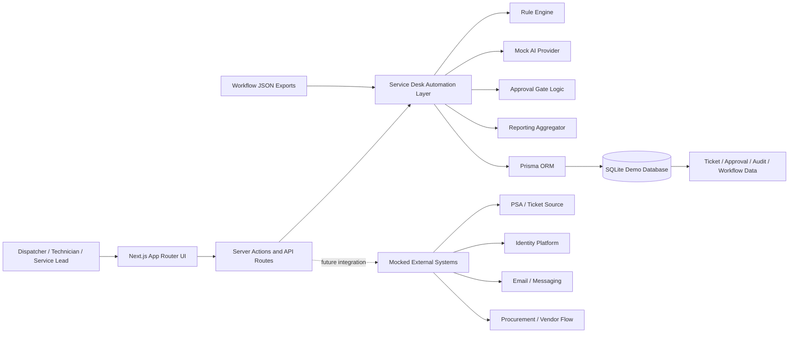

# System Architecture

## Notes

- The web UI is intentionally internal-tool oriented: dense, fast to scan, and built around operational decision-making.
- `Server Actions` drive the in-app forms, while `API Routes` expose the same logic for mock integration scenarios.
- The automation layer keeps deterministic rules and AI-assisted recommendations separate so the decision path remains inspectable.
- SQLite keeps local setup friction low while still giving the project a credible relational data model.
- Workflow JSON exports in [`workflows/exports`](../workflows/exports) show how the same flow could be represented in an automation platform such as n8n.
